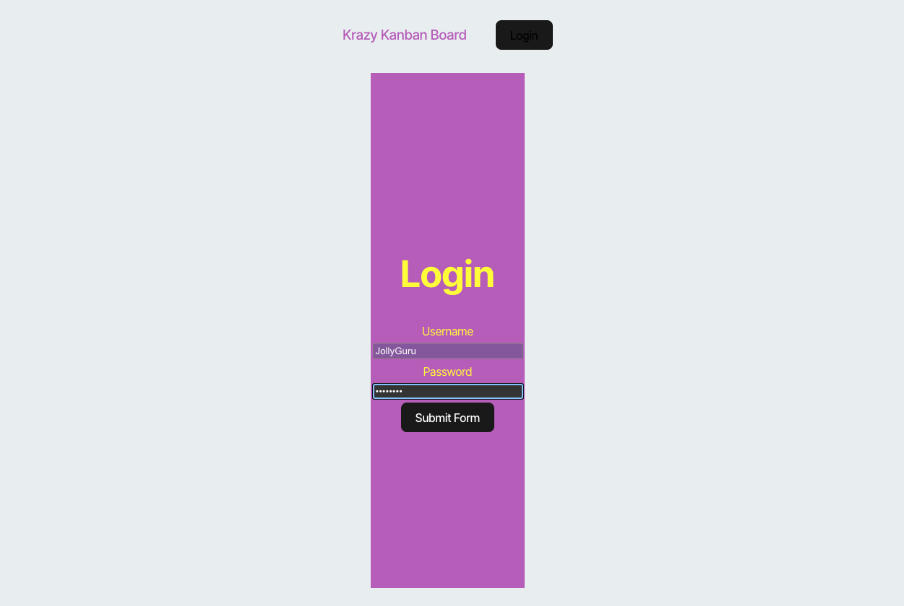
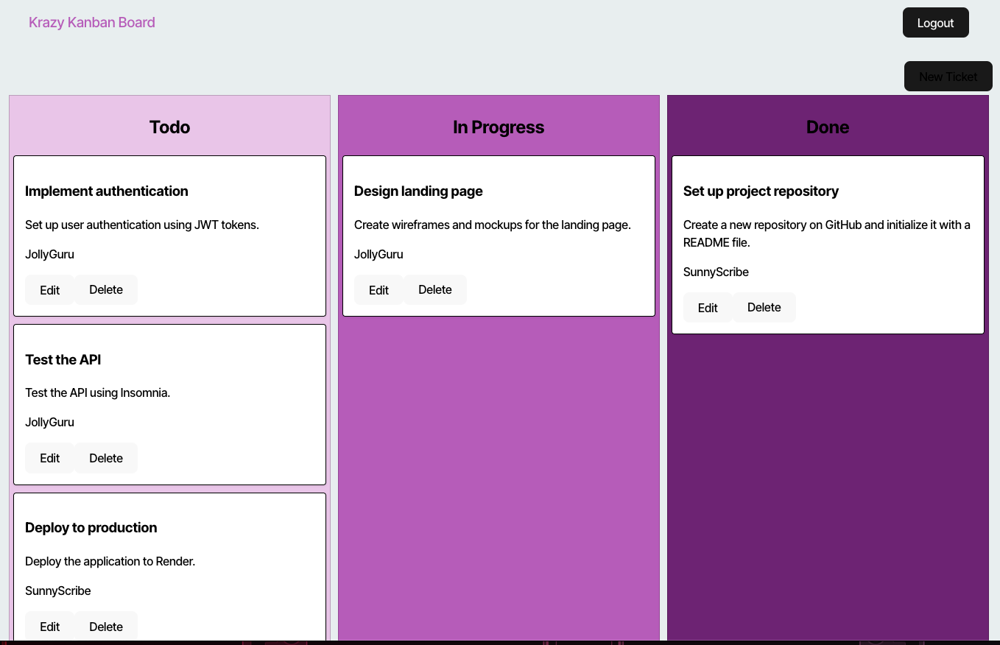

# Kanban-Board

## Description

Simple Kanban board with user authentication. The application was to use JWT's behind the scene. Whole functionality to explore authentication with this auth system. 

## Table of Contents

- [Installation](#installation)
- [Usage](#usage)
- [License](#license)
- [Contributors](#contributors)
- [Tests](#tests)
- [Future Development](#future-development)

## Installation

'npm install', then 'npm run start' after cloning down to local machine. Full production of this application can be found [here]().

## Usage

'npm run render-build && cd server && npm run build && npm run seed'

Demo username and password:
`JollyGuru`
`password`

Login using seed data, if you choose to use your own data you will need to manually enter in the database. 

## License

This application is covered under the [MIT](https://opensource.org/licenses/MIT) license.

## Contributors
This projects was completed using, VSCode, ChatGPT, tutor sessions with TA Fancisco Rivera, peer help, and deployed using Render. 

## Tests

Load up the application following the installation process and watch the console for any errors.

## Future Development

GitHub: [Kanban Board](https://github.com/carlbr3/Kanban-Board)

[Back to Top](#kanban-board)